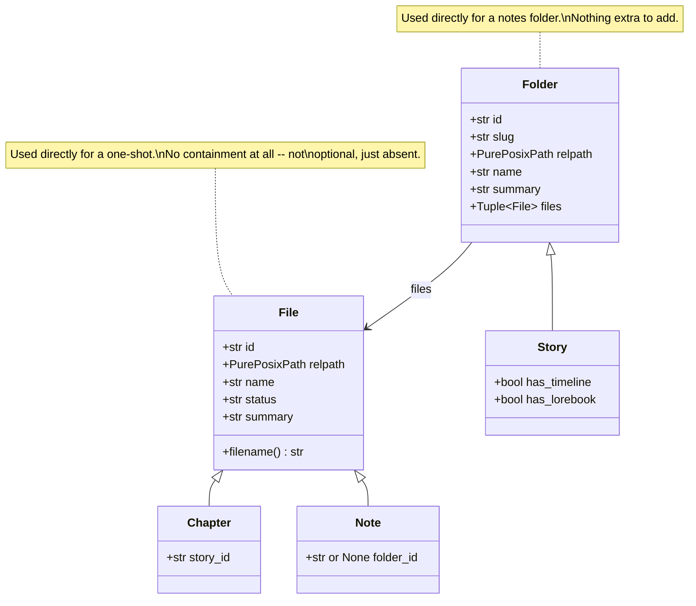

# The scan's own classes: `File`, `Folder`, and what each root adds

Both roots this API serves — the stories, and everything that is not a novel — are
read by walking a directory tree on disk and turning what is found into a small set
of plain dataclasses. Those dataclasses share a base shape where the underlying thing
really is the same concept, and add exactly the field each variant needs and no more.
This document names that hierarchy; `filesystem.md` in this same folder describes what
is actually on disk that the scan reads.

## The hierarchy

`File` and `Folder` live in `inkspire_api/entries.py`, imported by both `storage.py`
(the stories root) and `notes.py` (the second root). Neither root's scanner is shared —
`Scanner` and `NotesScanner` each walk their own root, in their own way, with a
different manifest filename, a different ordering rule, and different git treatment —
only the shapes a scan reads *into* are shared.

## `File`: one `.ink` file, wherever a scan found it

`id`, `relpath`, `name`, `status`, `summary`, and a `filename` property. Built from
exactly two calls, `ink.read_header` and `ink.display_name`, no matter which root's
scan does it — see `filesystem.md` for what the header itself looks like.

- **`Chapter(File)`** adds `story_id: str`, required. A chapter always belongs to
  exactly one story; there is no chapter without one.
- **`Note(File)`** adds `folder_id: str | None`. A note may sit in a folder or at the
  root of the notes space — `folder_id` names which, and is `None` for one at the
  root, so both cases are ordinary, valid states of the same field.
- **A one-shot is a bare `File`, not a third subclass.** It has no possible container
  at all — not "optionally none," structurally none, the same way a note or a chapter
  can have one. Promoting a one-shot into a story's chapter is not implemented
  (`PUT /api/stories/file/{id}` refuses a one-shot's `dir` outright), so nothing about
  its shape needs to accommodate that yet. `storage.py` keeps the name `OneShot` as an
  alias for `File` (`OneShot = File`) purely for readability at call sites such as
  `Scanner.create_one_shot()` — it is the same type, not a different one.

None/optional/required is three genuinely different containment cardinalities, each
dataclass carrying exactly the field that distinction needs. A wider alternative —
one class with both `story_id: str | None` and `folder_id: str | None` — was
considered and rejected: it would make invalid states representable (nothing would
stop both fields being set on one instance, which should never happen) and would give
every chapter a meaningless `folder_id` and every note a meaningless `story_id`.

## `Folder`: one directory, with the files found in it

`id`, `slug`, `relpath`, `name`, `summary`, and `files: tuple[File, ...]`.

- **`Story(Folder)`** adds `has_timeline: bool` and `has_lorebook: bool` — whether
  `timeline.yaml` and `lorebook/lorebook.yaml` sit beside this story's `story.yaml`.
  Neither is read by the scan itself; a client asks for either on its own route
  (`timelines.py`, `lore.py`). `Story.files` holds `Chapter` instances, in the order
  `story.yaml` sets.
- **A notes folder is a bare `Folder`** — nothing to add. `Folder.files` there holds
  `Note` instances, in name order, since the notes root records no order of its own.

`Folder.summary` is deliberately one field for what used to be two names for the same
idea: a story's `story.yaml` calls it `synopsis:`, a notes folder's `manifest.yaml`
calls it `context:` — different YAML keys, same role, "a short blurb describing what
this container is for." Both already serialised to the same `"summary"` key over the
API before this hierarchy existed; the dataclass field name now matches that, and each
scanner's own read/write code is what still knows which YAML key its own root uses
(`storage.py` reads `synopsis`, `notes.py` reads and writes `context` — see
`inkspire_api/notes.py`'s `folder_document()`). Nothing on disk changed to make this
true — only which Python attribute name reads it.

Likewise `Folder.files`/`Story.files` is one field where `Story.chapters` and a notes
`Folder.notes` used to be two names for the same relationship: "the files this
container holds," ordered however that container's own scanner decided to order them
before the tuple was ever built. Sharing the field name does not make the two roots
order their files the same way — that logic is untouched, and stays entirely inside
each scanner's own `_scan()`.

## Why not one shared scanner too

`storage.Scanner` and `notes.NotesScanner` remain two independent classes on purpose.
A story's manifest is `story.yaml`; a notes folder's is `manifest.yaml`, and is
optional in a way a story's manifest is not — a folder needs no file at all to exist.
A story's files are ordered by that manifest; a notes folder's are always ordered by
name. A chapter and a one-shot are committable; a note never is (`filesystem.md`,
*What git ever sees*). None of
`_scan()`'s actual walking, ordering, or
git-relevant logic is shared, only the dataclasses each `_scan()` builds — sharing the
scanner itself would mean branching on which root it is throughout that logic, which
is a worse trade than the two independent (and independently testable) classes this
keeps.
