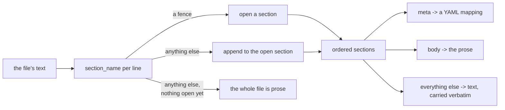

# The `.ink` file: named sections, one of which is the prose

A chapter, a one-shot and a note are all the same kind of file. This document describes what
is in one and the rules `ink.py` enforces about it; `provenance.md` in this same folder
describes the one section whose contents this module does not read, and `filesystem.md`
describes where these files sit on disk.

## The shape

A file is a sequence of sections. Each opens with a fence line naming it and runs to the next
fence line or to the end of the file.

```
===== ink:meta
title: The Letter in the Study
status: draft
summary: |
  She finally opens it, and it is not what she was told it was.
===== ink:body
She had not opened it. Three years of not opening it, and the wax still held.
===== ink:provenance
"47f57caaa4fb330e": [[18, 45, "gen"], [45, 54, "fix"]]
```

**A file with no fence line anywhere is all prose.** That is what a writer gets by creating a
file and typing in it, and it is what keeps these legible to anything that reads text.

## The grammar

Every line is classified before anything is parsed. Written directly over characters the
grammar would need negative lookahead — "any line that is not a fence" — which BNF cannot
express without enumerating the complement. So: lex, then parse the line stream.

```abnf
; lexical — classify each line
fence-line = "=====" 1*SP "ink:" name *SP EOL
name       = 1*32( %x61-7A / "_" )        ; lowercase ASCII and underscore
text-line  = *( %x00-09 / %x0B-FF ) EOL   ; any line that is not a fence-line
EOL        = LF / CRLF

; syntactic — over the classified lines
file     = bare / *section
bare     = *text-line                     ; no fence anywhere: the whole file is body
section  = fence-line *text-line
```



### What the grammar settles

| Point | Rule |
|---|---|
| Fence length | Exactly five `=`. Not "five or more" — that is how Markdown invites ambiguity |
| Fence position | Must start the line. At least one space before `ink:`, trailing spaces allowed, a tab is not a space |
| Section name | Lowercase ASCII and underscore, 1-32 characters, case-sensitive |
| Required sections | None |
| A file with no fence at all | Parses as body only. `Document.sections` is empty, which is what tells "never had a provenance section" from "has an empty one" |
| Prose outside a section | Only in that bare case. A file with a preamble above its first fence parses as **bare** — all of it prose — because losing a provenance section is recoverable from history and losing prose is not. `ink check` reports it |
| A repeated section name | The last occurrence wins, as a YAML mapping would. `ink check` reports it |
| An unknown section name | **Preserved verbatim through a round trip.** An older build must never delete a newer build's metadata |
| A fence-looking line inside prose | Cannot be represented. `render` **raises** rather than writing a file it could not read back. It is never escaped silently |
| Line endings | `LF` and `CRLF` each preserved per line inside a section. Fence lines are written `LF`, being the format's and not the writer's |
| Round trip | Byte-identical, with one exception: a fence must start a line, so a section followed by another is given a closing newline where it has none. `render` adds it once and every later read and write is stable |

`---` means nothing here, so it is free to be a Markdown horizontal rule in prose.

## The sections defined today

**`ink:meta`** — a YAML mapping. `KNOWN_KEYS` is `("title", "status", "summary")`; any other
key is preserved but not understood. `title` is the name the file is shown under, which is why
a file can be renamed without being moved. `status` is a free string, with `outline`, `draft`,
`revised` and `done` suggested. `summary` says what happens in the file.

**It has to come first.** `read_header` reads only the first `MAX_HEADER_BYTES` of a file so
that listing a tree does not load every chapter in it, so a header further down would not be
found. `render` always writes it first and `ink check` reports a file where it is not first.

A truncated header is told from a short file by whether the read stopped at the budget or at
the end of the file: a `meta` section with nothing after it is the whole file only in the
second case.

**`ink:body`** — the prose, opaque here, Markdown as far as the frontend is concerned. This is
exactly what `GET /file/{id}/contents` returns: nothing to strip, no markup of ours in it.

**`ink:provenance`** — who wrote each character. Carried from disk to the caller and back
without being read here, which is what lets the format gain a section without this module
changing. `provenance.md` describes it.

## Two rules the rest of the application depends on

> **The header holds metadata that is independent of the body. A further section holds
> metadata that is derived from it.**

That is the reason for the second rule, which is the same fact stated as a constraint:

> **No route may write the body without the sections derived from it.**

The moment one does, a derived section's hashes stop matching the prose and the next load
discards provenance the writer just created. `render` takes all three parts with no defaults
for exactly this reason — there is no signature that can write prose and leave a stale hash
behind it — and both roots write a document through one function, `ink.render_with`, so the
rule has one implementation rather than two that can drift.

## Reading is forgiving; `ink check` is where it is judged

A file must never disappear from a tree because its first lines are malformed, so `parse` keeps
what it can and reports nothing:

- A `meta` section that is not YAML, or is not a mapping, costs **the metadata and nothing
  else**. The fences say where the prose starts, so a broken header cannot take the prose with
  it.
- A preamble above the first fence makes the file bare: all of its text is kept as prose.
- A run beyond the end of a paragraph is clamped rather than raised on.

`ink check` is where the same files are judged:

```bash
poetry run inkspire ink check                        # every .ink file in both roots
poetry run inkspire ink check stories/example-story  # or only what is named
```

It prints `path:line: level: message` and exits non-zero if any file carries an error, so it
can gate a commit. A warning alone exits 0.

| Level | Reported for |
|---|---|
| error | prose above the first section; a section opened twice; `meta` not first; `meta` not valid YAML or not a mapping; a known key whose value is not text; a title over two lines |
| warning | a key the format has no meaning for; a section name the format has no meaning for |

## Routes

Identical behaviour in the stories and the notes roots.

| Route | Answers |
|---|---|
| `GET /file/{id}` | the header's fields |
| `GET /file/{id}/contents` | the prose, `text/plain` |
| `GET /file/{id}/document` | `{ "body", "metadata", "reconciled" }` — the editor's read, one round trip |
| `PUT /file/{id}/document` | takes `{ "body", "metadata" }` — the editor's write, one atomic write |

There is no route that writes the prose on its own, by the rule above. Reading it alone is
fine, and is what the reading view, the dashboard word count and the generation path use.

`PUT /file/{id}/document` keeps the guarantee that the header is read from disk at the moment
of the write rather than taken from the client, so a title or a status changed by hand
meanwhile survives.

Two routes considered and rejected: `GET /file/{id}/header` is redundant with
`GET /file/{id}` and with `/tree`, which already carries every file's header fields in one
response; `GET /file/{id}/metadata` has no caller, because a section derived from the body is
only meaningful beside the body it came from.
