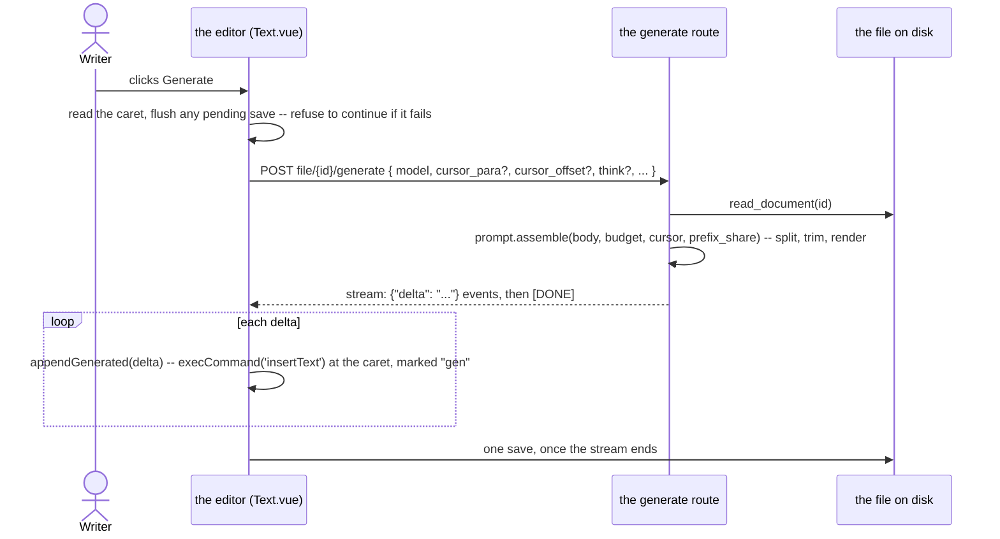
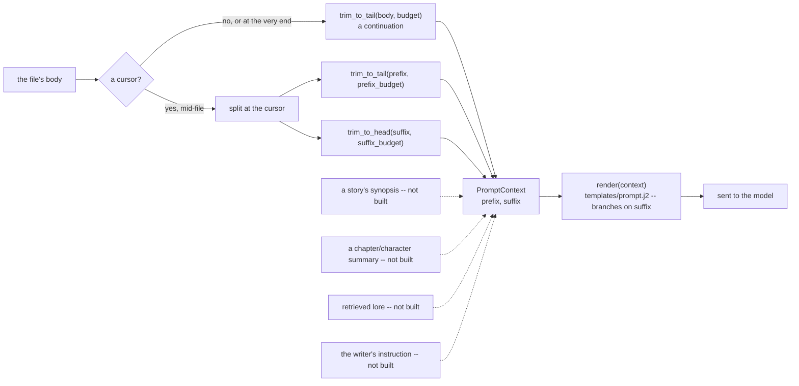

# The generation prompt: assembled on the server, inserted by the editor

`POST /api/stories/file/{id}/generate` and its `/api/notes` counterpart stream a continuation —
or, with a caret reported mid-file, a fill-in-the-middle — of a chapter's or a note's own text.
This document describes what is sent to the model, in what order, and why the server builds it
while the editor stays the only thing that writes a character into the file. `provenance.md` in
this same folder describes how a generated character is marked once it lands; this document
stops at the moment it is handed to the editor.

## One request, the file read fresh



The request carries no text. The server reads the file the same way `GET .../contents` does,
through the scanner's own `read_document`, so what is asked about is always what is on disk —
not whatever an open tab happens to hold. That is only true, though, if the tab's own edits are
on disk *before* the request is sent: the editor flushes its pending save first and refuses to
generate if that save fails, rather than silently asking about text one sentence out of date. A
cursor is read from the editor at the same moment, for the same reason: it is only meaningful
against the text that is about to be on disk.

## Assembly



`PromptContext` (`inkspire_api/prompt.py`) is every section the template can render: `prefix`
and `suffix` today, nothing else. Each later section is a new field here and a guarded block in
the template — never a change to an existing field — which is why the prompts pinned in
`tests/data/prompts.json` are untouched by a later section existing at all: nothing renders that
was not already rendering.

### The caret, and why its absence is not a special case written twice

A generation with no caret, or with one sitting at the very end of the file, is a continuation:
the whole body becomes the prefix, the suffix is empty, and `assemble` never apportions the
budget between two sides that do not both exist. **That degenerate case is detected before the
split, not after**: a caret at the end of the last paragraph has nothing after it but the body's
own closing separator, and a literal split would hand that separator to the suffix — making a
file that merely ends with a blank line take the fill-in-the-middle branch for no content at
all. `assemble` checks for this and falls back to the plain, no-cursor path, so it is
byte-identical to never having reported a caret.

With a real caret mid-file, `split_at_cursor` cuts the paragraph it sits in at the given offset:
the head joins the prefix, the tail joins the suffix. Each side is then trimmed independently —
`trim_to_tail` for the prefix, `trim_to_head` (its mirror: keeps whole paragraphs from the
*start* forwards, and never *ends* on a blank line rather than never opening on one) for the
suffix — within its own share of the budget:

- **The whole budget goes to the prefix when there is no suffix.** Continuation quality depends
  mostly on what precedes the caret, which is also the only case that existed before the caret
  did, and it is why apportioning only happens once a suffix is actually there to apportion for.
- **`INKSPIRE_LLM_PREFIX_SHARE`** (default `0.75`) splits the budget once there is a suffix:
  75% before the caret, 25% after. The frontend reports the caret as a paragraph index and an
  offset within it (`frontend#21`, `cursor.ts`'s `cursorFromOffset`) rather than a flat offset,
  resolved against the same `split_paragraphs` the provenance key already uses — the one
  paragraph rule this codebase has, matched byte for byte on both sides (`provenance.md`).

### The trim

`trim_to_tail`/`trim_to_head` cut a side longer than its budget at a paragraph boundary, using
`provenance.split_paragraphs` — writing a second paragraph rule here would disagree with the
record a `.ink` file already keeps.

- Whole paragraphs are kept from the relevant end. The prefix drops the leading separator of
  whatever it keeps, so it never opens on a blank line; the suffix drops the trailing one, so it
  never closes on one. Each keeps its *other* separator as given — the prefix's real trailing
  one when there is no cursor (so the trim changes nothing about how the body actually ends),
  the suffix's real leading one, which only matters when the suffix is the whole rest of a body
  that opens on blank lines.
- A single paragraph that alone exceeds its budget falls to a ladder: whole lines from the
  relevant end, then a hard character cut if even one line alone is too long — always keeping
  that end, the same ladder the chunked-reading design (api#12) specifies for the same reason.
- **The trim is silent.** The writer is not told the opening of a long chapter was dropped.
  Carrying context beyond the window is later work — a rolling summary (api#14's own "later"
  section), a story's synopsis (api#17) — not a warning on every generation past the budget.

### The budget, and the three numbers around it

```
tokens(rendered prompt) + reserved output   ≤   num_ctx   ≤   the model's real context window
```

Three settings, each answering a different question, and only the first two travel together on
one request:

- **`INKSPIRE_LLM_PROMPT_BUDGET`** (default `10 000`, overridable per request as
  `prompt_budget`) is a limit the server enforces on *itself*, in **characters**, over the
  prose alone — the template's own instructions are fixed overhead on top. It exists because
  mainstream models now carry windows of 32k tokens and more, so a per-model token-derived
  budget would almost always lose a `min()` against a flat ceiling anyway; the only thing left
  worth computing per generation is the **split** between the prefix and the suffix
  (`INKSPIRE_LLM_PREFIX_SHARE` above), not the budget's size.
- **`INKSPIRE_LLM_NUM_CTX`** (overridable per request as `num_ctx`) is sent to Ollama's
  `options.num_ctx` and tells the runtime how large a window to *allocate*. Left unset, the
  model's own default applies, and the server does not know what that number is. This is the
  number the budget actually has to stay under: exceed it and Ollama drops tokens off the
  **front** of the prompt — the instructions, not the prose — and answers an ordinary 200 with
  nothing in the response saying anything was dropped.
- **A model's real context window** is a fact about the model, not a setting. It is not
  configured anywhere in this codebase (see "Not yet built" below) — `num_ctx` is the number
  that actually governs behaviour, and it can be set below, at, or above the real window.

10 000 characters is roughly 2 100 tokens of English prose and, measured against a local model,
about 2.5 seconds of prompt evaluation — "a few seconds" is the limit this number was chosen
against, not a count of tokens a window could hold. **That 4.78-characters-per-token figure is
English-calibrated.** A CJK-heavy file runs closer to one token per character — 10 000
characters of Chinese is nearer 7 000–10 000 tokens than 2 100 — so a budget that looks
comfortably under `num_ctx` in characters can still overrun it in tokens for a script this was
never measured against. `tests/data/prompts.json`'s `cjk` case exercises the render, not this
arithmetic; nothing here corrects for it. Real token counting needs a per-model tokenizer and is
not built.

## Per-request settings, and where they live

`GenerateRequest` carries `temperature`, `prompt_budget`, `prefix_share` and `num_ctx` alongside
`think`, each overriding the server's own configuration for that one request when given, and
falling back to it otherwise (`GenerationOptions.overlay`). `GET /api/llm/defaults` answers the
server's own values, so a client has something to initialise a settings panel against and
something to reset to.

**`LLMService` holds its defaults, never a request's override, as instance state.** It is a
singleton on `app.state` (`get_service`), kept alive across requests so the model cache
outlives any one of them — an override written onto `self` would leak into the next request to
reuse the same service. `GenerationOptions` is built fresh per request by overlaying
`GenerateRequest`'s non-`None` fields onto `service.defaults`, and passed down as a plain
argument through `stream`/`_payload` rather than ever touching the service's own attributes.

Not overridable: the rate limit (`throttle.py`) and the provider timeout. Both are
infrastructure protecting the server and the provider, not a writing choice, and letting a
request raise its own limit would defeat the limit entirely.

`.env` is the default on a machine with nothing chosen yet; the frontend's settings panel
(`sharedSettings.ts`) persists a writer's own choice in `localStorage` from the first change on,
which is why it is `.env` → `localStorage` → request, not `.env` → request alone.

## Why the server assembles and the editor inserts

The server decides what the model is asked. It does not decide where the answer's characters
land in the file — the response stays a stream of `{"delta"}` events, and the editor inserts
each one, at the caret it reported in the request. Four properties of the existing editor make
that the only workable split:

1. **Native undo.** `MarkdownEditor.vue`'s `appendGenerated` inserts each delta through
   `document.execCommand('insertText')`, specifically so it lands on the browser's own undo
   stack. Colour is painted with `CSS.highlights`, which creates no DOM node, rather than
   wrapping characters in a span, because re-wrapping just-typed characters was measured to
   discard their undo entry. Writing the file server-side and having the editor re-fetch would
   set the element's `textContent` — the one write that component's own contract says never
   happens while the writer is editing — and Ctrl+Z would no longer walk a generation back.
2. **Streaming.** A generation measured here runs 2.5–8 seconds end to end. A server that
   writes the file and then tells the client to reload either drops that streaming experience
   entirely, or streams the deltas anyway — in which case the editor is already inserting them,
   and a server-side write of the same text is redundant.
3. **Reroll** (api#5) deletes the trailing model-written run through the browser's own editing
   command, so the reroll itself is undoable. That requires the generation it is replacing to
   already be on the undo stack, which only client-side insertion puts there.
4. **One writer, not two.** A generation lasts seconds, and the writer may keep typing, or
   press Stop and keep whatever arrived. Today only the editor ever writes the file during
   that window, so there is nothing to reconcile. A second writer — the server, mid-stream —
   would create a conflict that does not exist today.

The server *could* record which characters it generated and mark them `gen` itself — it knows.
That is not the reason for this split; undo is. It is noted here so the choice is not mistaken
for one made on provenance grounds.

The redundant upload this still leaves — the editor's save, right after a generation, of the
whole file it just finished streaming into — is real, and is not what this change fixes. It
goes away with api#13's paragraph-level diff, which turns that save into a few dozen bytes
instead of the whole document.

## Not yet built

- **Real token counting.** The budget is a character count calibrated on English; nothing here
  measures actual tokens for a given model, and the CJK gap above is the consequence. Needs a
  per-model tokenizer.
- **Auto-detecting a model's real context window.** `num_ctx` is set (or left unset) by hand;
  nothing reads what a model can actually do and suggests or enforces a ceiling from it.
- **A story's synopsis, a notes folder's context, a chapter or character summary, retrieved
  lore, the writer's own instruction.** Each is a field on `PromptContext` and a block in
  `prompt.j2`; none exist yet. See api#17, api#18, api#19/frontend#24, api#15.
- **Rewriting a selected passage** instead of a continuation or a mid-file insertion — a third
  shape, not a special case of the other two (api#20/frontend#25).
