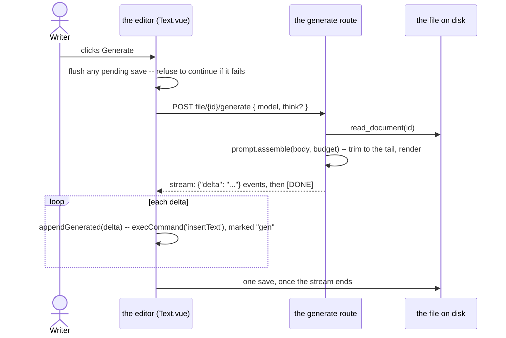
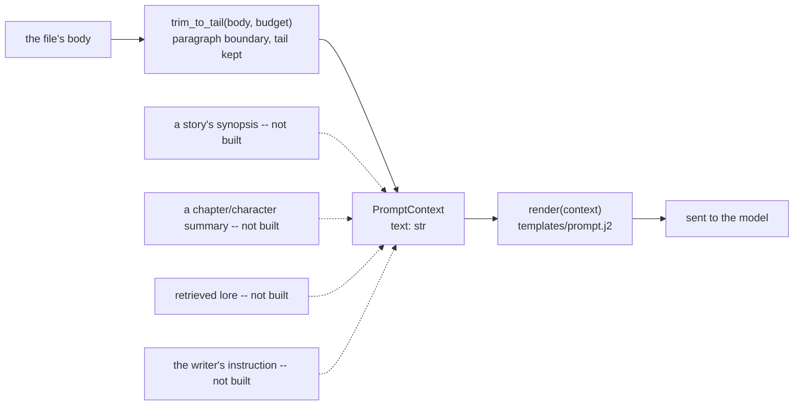

# The generation prompt: assembled on the server, inserted by the editor

`POST /api/stories/file/{id}/generate` and its `/api/notes` counterpart stream a continuation
of a chapter's or a note's own text. This document describes what is sent to the model, in
what order, and why the server builds it while the editor stays the only thing that writes a
character into the file. `provenance.md` in this same folder describes how a generated
character is marked once it lands; this document stops at the moment it is handed to the
editor.

## One request, the file read fresh

The request carries no text. The server reads the file the same way `GET .../contents` does,
through the scanner's own `read_document`, so what is asked about is always what is on disk —
not whatever an open tab happens to hold. That is only true, though, if the tab's own edits are
on disk *before* the request is sent: the editor flushes its pending save first and refuses to
generate if that save fails, rather than silently asking about text one sentence out of date.

## Assembly

`PromptContext` (`inkspire_api/prompt.py`) is every section the template can render. Only
`text` exists today. Each later section is a new field here and a guarded block in the
template — never a change to an existing field — which is why the ten prompts pinned in
`tests/data/prompts.json` are untouched by this module existing at all: nothing renders that
was not already rendering.

### The trim

`trim_to_tail` cuts a file longer than the budget to its tail, at a paragraph boundary, using
`provenance.split_paragraphs` — the same rule the provenance key is built on and the one the
frontend matches byte for byte (`provenance.md`). Writing a second paragraph rule here would
disagree with the record a `.ink` file already keeps.

- Whole paragraphs are kept from the end backwards. The leading separator of whatever is kept
  is dropped, so the prompt never opens on a blank line; the trailing one is kept, so the trim
  changes nothing about how the body ends.
- A single paragraph that alone exceeds the budget falls to a ladder: whole lines from the
  tail, then a hard character cut if even the last line alone is too long — always keeping the
  tail, the same ladder the chunked-reading design (api#12) specifies for the same reason.
- **The trim is silent.** The writer is not told the opening of a long chapter was dropped.
  Carrying context beyond the window is later work — a rolling summary (api#14), a story's
  synopsis (the issue opened alongside this one) — not a warning on every generation past the
  budget.

### The budget

`INKSPIRE_LLM_PROMPT_BUDGET`, 10 000 characters by default, bounds the writer's prose alone —
the template's own instructions are fixed overhead on top. 10 000 characters is roughly 2 100
tokens and, measured against a local model, about 2.5 seconds of prompt evaluation: inside "a
few seconds," which is the limit this number was chosen against, not a count of tokens a
context window could hold. Per-model, token-derived budgets are later work (api#14), once the
caret and a prefix/suffix split exist to make a token-accurate number worth computing.

`INKSPIRE_LLM_NUM_CTX` should be set comfortably above the prompt budget. Raising it costs
almost nothing once a model is loaded, and it is the only thing standing between the budget
above and a provider's own silent truncation: Ollama enforces `num_ctx` by dropping tokens off
the front of the prompt and answering an ordinary 200, with nothing in the response saying
anything was dropped. A prompt trimmed to fit the budget, sent to a context window sized above
it, never meets that silent truncation at all.

## Why the server assembles and the editor inserts

The server decides what the model is asked. It does not decide where the answer's characters
land in the file — the response stays a stream of `{"delta"}` events, and the editor inserts
each one. Four properties of the existing editor make that the only workable split:

1. **Native undo.** `MarkdownEditor.vue`'s `appendGenerated` inserts each delta through
   `document.execCommand('insertText')`, specifically so it lands on the browser's own undo
   stack. Colour is painted with `CSS.highlights`, which creates no DOM node, rather than
   wrapping characters in a span, because re-wrapping just-typed characters was measured to
   discard their undo entry. Writing the file server-side and having the editor re-fetch would
   set the element's `textContent` — the one write that component's own contract says never
   happens while the writer is editing — and Ctrl+Z would no longer walk a generation back.
2. **Streaming.** A generation measured here runs 2.5–8 seconds end to end. A server that
   writes the file and then tells the client to reload either drops that streaming experience
   entirely, or streams the deltas anyway — in which case the editor is already inserting them,
   and a server-side write of the same text is redundant.
3. **Reroll** (api#5) deletes the trailing model-written run through the browser's own editing
   command, so the reroll itself is undoable. That requires the generation it is replacing to
   already be on the undo stack, which only client-side insertion puts there.
4. **One writer, not two.** A generation lasts seconds, and the writer may keep typing, or
   press Stop and keep whatever arrived. Today only the editor ever writes the file during
   that window, so there is nothing to reconcile. A second writer — the server, mid-stream —
   would create a conflict that does not exist today.

The server *could* record which characters it generated and mark them `gen` itself — it knows.
That is not the reason for this split; undo is. It is noted here so the choice is not mistaken
for one made on provenance grounds.

The redundant upload this still leaves — the editor's save, right after a generation, of the
whole file it just finished streaming into — is real, and is not what this change fixes. It
goes away with api#13's paragraph-level diff, which turns that save into a few dozen bytes
instead of the whole document.

## Not yet built

- **The caret.** The server assembles the tail of the file, which matches today's behaviour —
  generation always continuing at the end. Generating at the caret (api#14) needs the caret
  reported by the frontend (frontend#21) and a prefix/suffix split inside `assemble`.
- **A story's synopsis, a notes folder's context, a chapter or character summary, retrieved
  lore, the writer's own instruction.** Each is a field on `PromptContext` and a block in
  `prompt.j2`; none exist yet. See the issues opened alongside this document.
