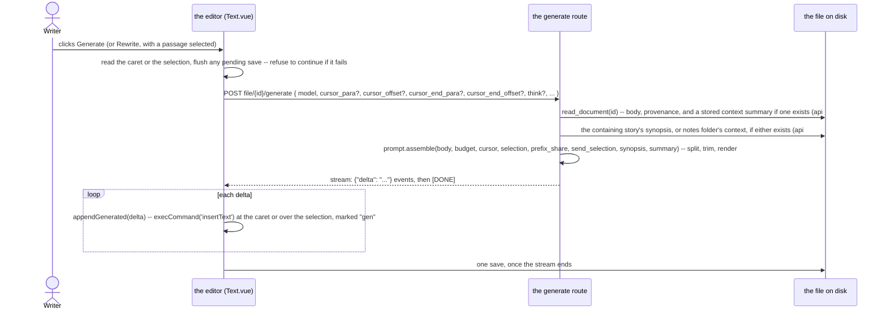
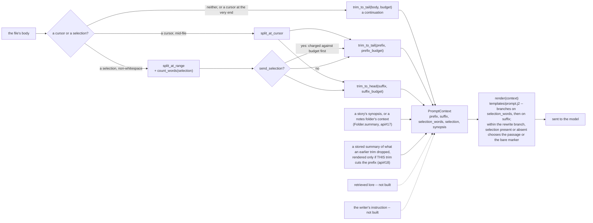

# The generation prompt: assembled on the server, inserted by the editor

`POST /api/stories/file/{id}/generate` and its `/api/notes` counterpart stream one of three
shapes: a continuation; with a caret reported mid-file, a fill-in-the-middle; with a selection
reported instead, a rewrite of the passage inside it. This document describes what is sent to
the model, in what order, and why the server builds it while the editor stays the only thing
that writes a character into the file. `provenance.md` in this same folder describes how a
generated character is marked once it lands; this document stops at the moment it is handed to
the editor.

## One request, the file read fresh



The request carries no text. The server reads the file the same way `GET .../contents` does,
through the scanner's own `read_document`, so what is asked about is always what is on disk —
not whatever an open tab happens to hold. That is only true, though, if the tab's own edits are
on disk *before* the request is sent: the editor flushes its pending save first and refuses to
generate if that save fails, rather than silently asking about text one sentence out of date. A
cursor or a selection is read from the editor at the same moment, for the same reason: it is
only meaningful against the text that is about to be on disk.

## Assembly



`PromptContext` (`inkspire_api/prompt.py`) is every section the template can render: `prefix`,
`suffix`, `selection_words`, `selection`, `synopsis` (api#17) and `summary` (api#18) today,
nothing else. Each later section is a new field here and a guarded block in the template —
never a change to an existing field — which is why the prompts pinned in
`tests/data/prompts.json` are untouched by a later section existing at all: nothing renders
that was not already rendering.

`synopsis` is a story's own synopsis or a notes folder's own context — two on-disk names
(`story.yaml`'s `synopsis`, a notes folder manifest's `context`) for the one in-memory field
both scanners already agree on, `Folder.summary` (`entries.py`), so there was only ever one
value to thread through here rather than two. The route looks it up once, from whichever
containing folder applies — `scanner.story(chapter.story_id)` for a chapter,
`notes.folder(note.folder_id)` for a note in one, `""` for a one-shot or a root-level note,
neither of which has a containing folder at all — and passes it to `LLMService.stream` as a
plain string; `assemble` never trims it and never charges it against the budget, unlike the
prefix, the suffix or a shown selection, since it is short by construction at the source (the
frontend's own `MAX_SUMMARY_LENGTH`). Renders in the one slot marked for it, above the
continuation/fill-in-the-middle/rewrite instructions and therefore identical across all three,
and only when it is not empty — an empty one leaves the prompt byte-identical to before this
field existed.

### The caret, and why its absence is not a special case written twice

A generation with no caret, or with one sitting at the very end of the file, is a continuation:
the whole body becomes the prefix, the suffix is empty, and `assemble` never apportions the
budget between two sides that do not both exist. **That degenerate case is detected before the
split, not after**: a caret at the end of the last paragraph has nothing after it but the body's
own closing separator, and a literal split would hand that separator to the suffix — making a
file that merely ends with a blank line take the fill-in-the-middle branch for no content at
all. `assemble` checks for this and falls back to the plain, no-cursor path, so it is
byte-identical to never having reported a caret.

With a real caret mid-file, `split_at_cursor` cuts the paragraph it sits in at the given offset:
the head joins the prefix, the tail joins the suffix. Each side is then trimmed independently —
`trim_to_tail` for the prefix, `trim_to_head` (its mirror: keeps whole paragraphs from the
*start* forwards, and never *ends* on a blank line rather than never opening on one) for the
suffix — within its own share of the budget:

- **The whole budget goes to the prefix when there is no suffix.** Continuation quality depends
  mostly on what precedes the caret, which is also the only case that existed before the caret
  did, and it is why apportioning only happens once a suffix is actually there to apportion for.
- **`INKSPIRE_LLM_PREFIX_SHARE`** (default `0.75`) splits the budget once there is a suffix:
  75% before the caret, 25% after. The frontend reports the caret as a paragraph index and an
  offset within it (`frontend#21`, `cursor.ts`'s `cursorFromOffset`) rather than a flat offset,
  resolved against the same `split_paragraphs` the provenance key already uses — the one
  paragraph rule this codebase has, matched byte for byte on both sides (`provenance.md`).

### The selection, and whether the model sees it

A rewrite (api#20) anchors on a range instead of a point: `CursorRange(start, end)`. Structurally
it reuses the caret's own split — `split_at_range` is two calls to `split_at_cursor`, one at each
end, so both ends are validated by the function that already validates one — but the text
*inside* the range is handled differently from everything either side of it: whether it is
*sent* is a setting, while its word count always is. `PromptContext.selection_words` carries
`count_words(selection)` unconditionally, and `prompt.j2`'s rewrite branch asks for "roughly `N`
words, give or take a few" either way; `PromptContext.selection` carries the passage's own text
only when `assemble`'s `send_selection` says so, and the template shows it in place of the bare
`[REPLACE THIS]` marker when it is present.

- **Why this is a setting rather than a rule.** The original design withheld the passage
  entirely — api#20's own sketch used a bare marker, `<REPLACE THIS>`, with nothing inside it,
  reasoning that a continuation and a fill-in-the-middle already work without seeing what they
  are writing into. **Tested against a real model, that did not hold for a rewrite**: asked to
  replace text it cannot see, a model has nothing to preserve — not the subject of the sentence,
  not a name in it — and writes something of roughly the right length that does not belong where
  it goes. `INKSPIRE_LLM_SEND_SELECTION` (`llm.py`'s `GenerationOptions.send_selection`,
  `GenerateRequest.send_selection` per request) is on by default because of this; the CLI's
  `--no-send-selection` and the settings panel's checkbox exist for the case that still wants the
  freer, less anchored original behaviour.
- **The passage, when shown, is charged against `prompt_budget` first**, and the prefix and the
  suffix split whatever remains — `prompt_budget` keeps meaning the whole of the prose sent,
  rather than only the prose either side of a passage of unbounded size. The passage itself is
  **never trimmed**: a partial passage with an instruction to replace all of it is worse than no
  passage at all.
- **`count_words`** is `len(text.split())` — whitespace-based, and wrong for a script with no
  spaces between words. The same English-calibration gap the character budget below has,
  stated once there and not re-derived here.
- **No ceiling on how much may be rewritten at once.** A selection of a whole chapter asks for
  "roughly four thousand words"; no model delivers that, and the editor replaces the entire
  selection with whatever shorter text came back — recoverable through Ctrl+Z, one streamed
  chunk at a time, and only until the file is saved and reloaded. This is a way to lose prose.
  Decided against building a limit for it, rather than not having decided. Its consequence
  changed shape rather than going away once the passage could be shown: a passage large enough
  to exhaust `prompt_budget` on its own leaves **nothing** for the prefix and the suffix — the
  model is sent the passage and the instructions with no surrounding context at all, both guarded
  sections simply not rendering. `prompt_budget` still does not bound the passage itself, by the
  same decision.
- **Three degenerate cases**, all resolved in `_resolve_sides` before any trimming happens:
  a collapsed range (`start == end`) is the caret case verbatim; a selection whose end sits at
  the very end of the file gives an empty suffix, for the same reason a caret there does — the
  body's own closing separator must not be handed to a side that is not supposed to have it; and
  a selection of nothing but whitespace (`count_words` of `0`) degenerates to a caret at its own
  start, so a rewrite can never be asked to produce zero words.
- **The instructions name whichever sides are actually present.** `prompt.j2`'s rewrite branch
  used to say "flows from the text before it directly into the text after it" and "do not
  pre-empt or duplicate the text after" regardless of whether `ctx.prefix`/`ctx.suffix` were
  empty — wrong for exactly the two degenerate cases above, reachable today by selecting the
  first or last paragraph and pressing Rewrite. Branched on `ctx.prefix and ctx.suffix` into four
  wordings (both sides, prefix only, suffix only, neither) rather than guarding the one sentence
  that happened to be reachable first.

### The trim

`trim_to_tail`/`trim_to_head` cut a side longer than its budget at a paragraph boundary, using
`provenance.split_paragraphs` — writing a second paragraph rule here would disagree with the
record a `.ink` file already keeps.

- Whole paragraphs are kept from the relevant end. The prefix drops the leading separator of
  whatever it keeps, so it never opens on a blank line; the suffix drops the trailing one, so it
  never closes on one. Each keeps its *other* separator as given — the prefix's real trailing
  one when there is no cursor (so the trim changes nothing about how the body actually ends),
  the suffix's real leading one, which only matters when the suffix is the whole rest of a body
  that opens on blank lines.
- A single paragraph that alone exceeds its budget falls to a ladder: whole lines from the
  relevant end, then a hard character cut if even one line alone is too long — always keeping
  that end, the same ladder the chunked-reading design (api#12) specifies for the same reason.
- **The trim is silent to the writer**, but not undocumented to the model: the writer is never
  told the opening of a long chapter was dropped, but a summary of what was dropped is sent in
  its place (api#18, below) once the small model has had a chance to produce one. A story's
  synopsis (api#17, above) is not this: it is independent of the trim boundary, sent in full
  regardless of how much of the body was cut. A rolling summary of the *whole* document,
  independent of any one trim, is still later work (api#14's own "later" section).

## Summarising what the trim dropped (api#18)

`trim_to_tail` cuts the opening of a long chapter off the prompt and says nothing about it --
so a continuation past the budget has no idea a character's name, a relationship, or an object
was already established on a page it can no longer see. This is the narrow fix: the exact
paragraphs one trim removes, summarised by a small model into one or two sentences, stored in
the file itself, and rendered back into the prompt — but only for a *later* generation whose
own trim cuts the same ground again, never for the generation whose save triggered the call.

**Computed in the background, on save, not blocking it.** `documents.py`'s `_write` --
shared by both the stories and the notes `PUT .../document` routes -- schedules
`summaries.update` through `BackgroundTasks.add_task` once the body is written, so the save
itself answers before any model call starts. Skipped silently, with no error surfaced anywhere
a writer can see, when: `INKSPIRE_LLM_SMALL_MODEL` is unset (the same setting `titles.py`'s
proposed-title route reads -- one knob for every short, non-generation call this server makes,
not one per feature); a call for this file is already running (a plain `set` of file ids,
`documents._SUMMARIZING`, needs no lock since `BackgroundTasks` runs on the event loop); or
this account's own `app.state.summary_limiter` -- a budget separate from generation's own, so a
writer who has been generating heavily cannot starve their own summaries -- is spent. Any of
these leaves the file exactly as a previous save left it; the next save's own call catches up.

**The trigger metric is proportional, not a fixed size.** `context_summary.is_due(dropped_chars,
stored)` compares what a trim would cut *now* against what the last stored summary was computed
from:

```
delta = abs(dropped_chars - stored)
due = delta >= max(MIN_TRIGGER_CHARS, stored * (GROWTH_FACTOR - 1))
```

`MIN_TRIGGER_CHARS` (2000) is a floor, so a chapter barely over budget does not spend a model
call on a couple of sentences' worth of change. `GROWTH_FACTOR` (2.0) makes the threshold double
each time -- due again at roughly 2k, 4k, 8k, 16k dropped characters -- so a story that keeps
growing asks for fewer summaries, less often, the longer it gets; a gentler factor (the
golden-ratio-ish 1.618) would ask more often at less staleness each time. The check is
**symmetric on purpose**: `abs()` catches a large deletion the same way it catches large growth,
because a growth-only check would never notice paragraphs the writer has since cut, and a
summary describing text that no longer exists could stand forever.

**Rendered only when this request's own trim actually fires.** `PromptContext.summary` is set
by `prompt.assemble` from the stored value, but only when `_trim_sides` reports that *this*
call's own `trim_to_tail` cut the prefix -- not whenever a summary happens to be sitting in the
file. A chapter can shrink below budget after a summary was stored (an edit, a cut); once that
happens nothing is being trimmed any more, the whole file is already in the prompt verbatim, and
rendering a summary of it on top would be redundant at best, describing text that may no longer
exist at worst. This is the same two-newline, verified-by-rendering guarded block every other
optional section in `prompt.j2` uses, captured once near the top of the template and emitted at
the slot each of the three branches already reserves for it.

**Stored in the body's own file, as `ink:context_summary`** (`docs/ink-format.md`), the one
section ever written outside the body's own atomic write -- a stale summary is a worse summary,
not corruption of a correctness record the way stale provenance would be, which is what makes
writing it on its own, in the background, safe here and nowhere else. `write_context_summary`
(`storage.py`, `notes.py`) refuses to write at all if the body has moved since the summary was
computed against it, and shares the scanner's own write lock with `write_document` so the two
can never interleave into a lost update.

**What the trigger metric cannot see.** A rewrite *inside* the dropped region that barely
changes its size -- renaming a character through the first ten chapters, say -- is invisible to
a size-based check by construction. A manual, forced-recompute action is the intended fix and is
not built (the issue's own "hidden manual trigger," left for a later, frontend-facing step).

**The dropped region is itself trimmed from the head, not the tail**, the same way
`titles.py`'s `assemble_title` trims a chapter's opening rather than its end: what establishes a
name or a fact is usually near the start of what was cut. A dropped region larger than the
summary call's own budget therefore loses its middle, not its start -- a rolling summary of the
whole document (api#14) is the eventual fix for that, and this is deliberately not it.

### The budget, and the three numbers around it

```
tokens(rendered prompt) + reserved output   ≤   num_ctx   ≤   the model's real context window
```

Three settings, each answering a different question, and only the first two travel together on
one request:

- **`INKSPIRE_LLM_PROMPT_BUDGET`** (default `10 000`, overridable per request as
  `prompt_budget`) is a limit the server enforces on *itself*, in **characters**, over the
  prose alone — the template's own instructions are fixed overhead on top. It exists because
  mainstream models now carry windows of 32k tokens and more, so a per-model token-derived
  budget would almost always lose a `min()` against a flat ceiling anyway; the only thing left
  worth computing per generation is the **split** between the prefix and the suffix
  (`INKSPIRE_LLM_PREFIX_SHARE` above), not the budget's size.
- **`INKSPIRE_LLM_NUM_CTX`** (overridable per request as `num_ctx`) is sent to Ollama's
  `options.num_ctx` and tells the runtime how large a window to *allocate*. Left unset, the
  model's own default applies, and the server does not know what that number is. This is the
  number the budget actually has to stay under: exceed it and Ollama drops tokens off the
  **front** of the prompt — the instructions, not the prose — and answers an ordinary 200 with
  nothing in the response saying anything was dropped.
- **A model's real context window** is a fact about the model, not a setting. It is not
  configured anywhere in this codebase (see "Not yet built" below) — `num_ctx` is the number
  that actually governs behaviour, and it can be set below, at, or above the real window.

10 000 characters is roughly 2 100 tokens of English prose and, measured against a local model,
about 2.5 seconds of prompt evaluation — "a few seconds" is the limit this number was chosen
against, not a count of tokens a window could hold. **That 4.78-characters-per-token figure is
English-calibrated.** A CJK-heavy file runs closer to one token per character — 10 000
characters of Chinese is nearer 7 000–10 000 tokens than 2 100 — so a budget that looks
comfortably under `num_ctx` in characters can still overrun it in tokens for a script this was
never measured against. `tests/data/prompts.json`'s `cjk` case exercises the render, not this
arithmetic; nothing here corrects for it. Real token counting needs a per-model tokenizer and is
not built.

## Per-request settings, and where they live

`GenerateRequest` carries `temperature`, `prompt_budget`, `prefix_share` and `num_ctx` alongside
`think` and `send_selection`, each overriding the server's own configuration for that one request
when given, and falling back to it otherwise (`GenerationOptions.overlay`). `GET
/api/llm/defaults` answers the
server's own values, so a client has something to initialise a settings panel against and
something to reset to.

**`LLMService` holds its defaults, never a request's override, as instance state.** It is a
singleton on `app.state` (`get_service`), kept alive across requests so the model cache
outlives any one of them — an override written onto `self` would leak into the next request to
reuse the same service. `GenerationOptions` is built fresh per request by overlaying
`GenerateRequest`'s non-`None` fields onto `service.defaults`, and passed down as a plain
argument through `stream`/`_payload` rather than ever touching the service's own attributes.

Not overridable: the rate limit (`throttle.py`) and the provider timeout. Both are
infrastructure protecting the server and the provider, not a writing choice, and letting a
request raise its own limit would defeat the limit entirely.

`.env` is the default on a machine with nothing chosen yet; the frontend's settings panel
(`sharedSettings.ts`) persists a writer's own choice in `localStorage` from the first change on,
which is why it is `.env` → `localStorage` → request, not `.env` → request alone.

## Why the server assembles and the editor inserts

The server decides what the model is asked. It does not decide where the answer's characters
land in the file — the response stays a stream of `{"delta"}` events, and the editor inserts
each one, at the caret it reported in the request. Four properties of the existing editor make
that the only workable split:

1. **Native undo.** `MarkdownEditor.vue`'s `appendGenerated` inserts each delta through
   `document.execCommand('insertText')`, specifically so it lands on the browser's own undo
   stack. Colour is painted with `CSS.highlights`, which creates no DOM node, rather than
   wrapping characters in a span, because re-wrapping just-typed characters was measured to
   discard their undo entry. Writing the file server-side and having the editor re-fetch would
   set the element's `textContent` — the one write that component's own contract says never
   happens while the writer is editing — and Ctrl+Z would no longer walk a generation back.
2. **Streaming.** A generation measured here runs 2.5–8 seconds end to end. A server that
   writes the file and then tells the client to reload either drops that streaming experience
   entirely, or streams the deltas anyway — in which case the editor is already inserting them,
   and a server-side write of the same text is redundant.
3. **Reroll** (api#5) deletes the `gen` run at the caret through the browser's own editing
   command, so the reroll itself is undoable, then generates again with a caret where that run
   started — a second sample of the same request, assembled the same way it was the first time,
   not a rewrite of the deleted span. That requires the generation it is replacing to already be
   on the undo stack, which only client-side insertion puts there. Only the client knows which
   run is the one to reroll: provenance records who wrote each character, not when, and the API
   never parses the provenance section on the generate path at all (`llm.py`'s route reads only
   `StoredDocument.body`) — reroll needed no change here.
4. **One writer, not two.** A generation lasts seconds, and the writer may keep typing, or
   press Stop and keep whatever arrived. Today only the editor ever writes the file during
   that window, so there is nothing to reconcile. A second writer — the server, mid-stream —
   would create a conflict that does not exist today.

The server *could* record which characters it generated and mark them `gen` itself — it knows.
That is not the reason for this split; undo is. It is noted here so the choice is not mistaken
for one made on provenance grounds.

The redundant upload this still leaves — the editor's save, right after a generation, of the
whole file it just finished streaming into — is real, and is not what this change fixes. It
goes away with api#13's paragraph-level diff, which turns that save into a few dozen bytes
instead of the whole document.

## A second prompt: proposing a title (api#25)

`POST /api/stories/file/{id}/title` is not a fourth branch of the prompt above. A title is a
different question — not a continuation, not a rewrite, nothing with a caret or a selection —
and answering it with a few words is a different shape of request from streaming prose, so it
gets its own module (`titles.py`), its own context (`TitleContext`), and its own template
(`templates/title.j2`). Folding it into `PromptContext` and `prompt.j2` instead would mean a
fourth branch keyed on some new flag, and every pinned case in `tests/data/prompts.json`
re-verified for a question that was never about continuing or rewriting anything.

`TitleContext` carries three things: the chapter's own text, trimmed from the *head* rather
than the tail (a chapter's opening is what it is about, where a continuation's prefix is
trimmed from the tail since what matters there is what comes right before the caret); the
chapter's *current* title, read from its own header (`scanner.file(id).name`, not the body);
and the writer's own `instruction`, from the title-edit modal's own field (`Tree.vue`,
frontend) — the dice button itself sends none. The second field exists because the first
version of this route had no way to tell the model a title was already proposed, so a reroll
tended to answer with a trivial reword of the first answer instead of a genuinely different
one. The third exists because knowing what *not* to repeat still leaves the model guessing at
what the writer actually wants; a short, literal instruction — "something ominous," "shorter"
— says so directly, for when the plain roll hasn't been satisfying.

Both optional fields render as paragraphs ahead of the bullet list, and both paragraphs'
actual wording lives in `title.j2` itself, not in Python — a deliberate choice: the whole
point of a template is that its prose is something to edit in place, not something baked into
a Python string a change here would have to touch instead. The first attempt at this moved
the current-title paragraph's wording into a `TitleContext.extra` property in `titles.py`,
joining it with the instruction paragraph there. That fixed the whitespace problem below, but
at the cost of the one thing this template exists for — a line like "Be creative" or the
numbering/formatting note was no longer something to add by editing `title.j2`, and from that
file's own point of view, both had simply vanished. Reverted, in favour of doing the same join
*inside* the template:

```jinja



Its current title is "{{ ctx.current_title }}" ...





The writer adds: {{ ctx.instruction }}




{{ extra }}

```

Each optional paragraph is captured into its own variable with a `...`
block — Jinja's own way to assign a rendered block of text to a name rather than emitting it
immediately — so its wording is ordinary template prose, editable exactly where the rest of
the template's prose is. `select` (Jinja's truthy filter, the same idea as Python's
`filter(None, ...)`) drops whichever paragraph is empty, and `join("\n\n")` puts one blank
line between whatever is left; the result renders through the one shape already proven not to
double a blank line when nothing is left at all: `{{ extra }}`. All
of the ``/`` plumbing around the two captures is fully whitespace-stripped on
both sides (`` throughout), so none of it is visible in the output regardless of
which, if either, paragraph exists — found by rendering every one of the four combinations,
not by reading the markers, the same discipline the rewrite branch's own wording fix (api#24)
was held to, and the reason the original two-independent-`` attempt's bug was caught
at all rather than shipped.

It is also not streamed. `LLMService.stream()` exists for prose arriving over several seconds;
a title is a handful of words arriving essentially at once, so `LLMService.complete()` answers
it in one response instead — the same provider payload shape, `"stream": false` rather than
`true`, decoded from one JSON body rather than a sequence of chunks.

It reads `INKSPIRE_LLM_SMALL_MODEL`, never the writer's own selected model: that model may be
hosted and metered, and was chosen for prose, not for a one-line side question. Unset, the route
refuses with 409 rather than silently falling back to whatever the writer picked. The same
setting governs api#18's own background summary call, above — one knob for every short,
non-generation call this server makes, not one per feature. Always asks with `think=False`,
regardless of `INKSPIRE_LLM_THINK`: a title has no business reasoning out loud, and a small
model with a small context window can spend all of it thinking and answer nothing.

A model's answer is not a title until `clean_title` has run on it — a quote, a `Title:` prefix,
a trailing full stop, or three alternatives on separate lines are all things a small model
reliably adds. `clean_title` is pure and tested on its own, separately from the route that calls
it.

## Not yet built

- **Real token counting.** The budget is a character count calibrated on English; nothing here
  measures actual tokens for a given model, and the CJK gap above is the consequence. Needs a
  per-model tokenizer.
- **Auto-detecting a model's real context window.** `num_ctx` is set (or left unset) by hand;
  nothing reads what a model can actually do and suggests or enforces a ceiling from it.
- **Retrieved lore, the writer's own instruction on Generate.** Each is a field on
  `PromptContext` and a block in `prompt.j2`, the way a story's synopsis (api#17) and the
  trimmed-context summary (api#18) already are; neither of these two exist yet. See
  api#19/frontend#24, api#15. A story's synopsis is the natural second field on `titles.py`'s
  own, separate `TitleContext` too, by the same reasoning, once something needs it there —
  api#25 is a different prompt, not this one.
- **The manual, forced-recompute trigger for api#18's own summary**, and any frontend
  surface for it at all. `/llm/features`'s `summary` key exists so a later UI has something
  to gate on; the action itself is the issue's own "hidden manual trigger," not built.
- **A ceiling on how much may be rewritten at once.** Decided against, not merely unbuilt —
  see "The selection" above.
