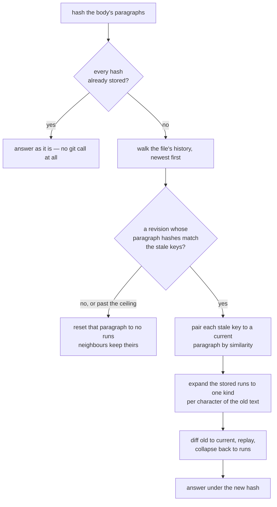

# Provenance: who wrote each character

Every character of a chapter carries one of three states — written by hand, written by a model,
or written by a model and then corrected by hand. This document describes how that is stored,
how it reaches a client, and what happens when a file is edited outside the editor.
`ink-format.md` in this same folder describes the file it lives in.

## Three kinds, one of them never stored

| Kind | Meaning |
|---|---|
| `user` | the writer typed it. **The default, and never stored** — absence means this |
| `gen` | a model wrote it |
| `fix` | a model wrote it and the writer has since corrected it |

Storing only the exceptions is what keeps the record small: a hand-written chapter's
provenance section is one empty entry per paragraph.

## Keyed by paragraph, not by position

The `ink:provenance` section is one entry per paragraph, keyed by a **hash of that paragraph's
own text**, whose value is the runs that are not `user`, as `[start, end, kind]` with offsets
**relative to the paragraph** and `end` exclusive.

```
"47f57caaa4fb330e": [[18, 45, "gen"], [45, 54, "fix"], [54, 75, "gen"]]
"7c2e9a15b3d04f88": []
```

Keying by content rather than by index means inserting, deleting or reordering paragraphs
leaves every other paragraph's record intact. Two identical paragraphs share one entry, which
is accepted: they cannot be told apart, so they cannot hold different runs.

The key is **quoted on the way out and resolved by nothing on the way back**. Every way YAML
resolves a bare scalar is wrong for a hash:

| Written bare | YAML makes it | Consequence |
|---|---|---|
| `1234567890123456` | the integer 1234567890123456 | matches no paragraph. **Roughly one hash in 1845 is all digits** |
| `0012345670123456` | **octal** — the integer 718046013230 | reads back as a *different* hash, so one hash written both ways becomes two entries |
| `yes` | the boolean `True` | unreachable from a hash, but the same mistake |

`render_section` quotes every key, which closes it for any file this writes. The section is
read with a loader that resolves nothing — every scalar comes back as written, and the offsets
are converted explicitly — which is what makes a file edited by hand, or written by a build
before this rule existed, read correctly anyway.

A section that cannot be read at all answers `None`, the same as a file with no section: the
prose is untouched and every paragraph renders plain. An **empty** section is a different
thing, and says the editor has been here and this prose is all the writer's.

## Two rules the frontend has to match byte for byte

Both sides compute the key, so both must agree on what a paragraph is and what it hashes to.

**The paragraph split.** A run of **two or more line endings** separates paragraphs, where a
line ending is `\n` or `\r\n`. Not two or more `\n`: under CRLF a blank line is `\r\n\r\n`,
whose newlines are not adjacent, so counting consecutive `\n` would never separate anything in
a file written on Windows. A single line ending inside a paragraph is a line break and keeps
the paragraph whole, and so does a blank line holding a space.

**Separators are kept, and there is one more of them than there are paragraphs** — one before
the first and one after the last, either possibly empty — so the body rebuilds byte for byte.
That `n+1` shape is what carries a body's leading blank lines *and* its closing newline
without either landing inside a paragraph's text. **The closing newline must stay out**:
`render` adds one where a section follows the body, and the last paragraph's hash would
otherwise move on the first save.

**The hash.** `blake2b` of the paragraph's text, UTF-8, first 16 hex characters. The same
primitive `derive_id` uses for file ids, and the same length, but its own constant: the two
agree today and answer different questions.

`tests/data/paragraphs.json` is that agreement written down — 15 cases covering the empty
body, a closing newline, long runs of blank lines, CRLF, a mixed separator, leading and
trailing blank lines, a line break inside a paragraph, `---` as prose, non-ASCII text, and two
identical paragraphs. **It is a specification, not a recording**: its expectations were written
by hand and each checked to rebuild its body, and its hashes came from `hashlib` directly
rather than through the module.

The frontend holds a byte-identical copy, because it cannot read a path inside this repository
and neither public repository's CI can clone the private one that holds both. The umbrella
repository's `scripts/check_vectors.py` fails if the two ever differ.

## Stale provenance, and recovering it

A paragraph edited outside the editor no longer hashes to its stored key, and those offsets now
describe prose that is gone.

**Recomputing the hash is not the fix.** It would record the new text while keeping offsets
measured against the old, turning something detectable into a silent wrong answer. In the
example below `gen` would begin five characters early, inside a word the writer typed.

So the paragraph's own earlier text is found in the file's history, diffed forward, and the
runs replayed over the result: characters that survived keep their kind, inserted ones become
`user`, deleted ones contribute nothing.



Worked example. Stored against `47f57caaa4fb330e`:

```
"The door creaked. The streets glistened like wet glass under the lamplight."   (75 chars)
  user [0,18)   "The door creaked. "        <- default, not stored
  gen  [18,45)  "The streets glistened like "
  fix  [45,54)  "wet glass"
  gen  [54,75)  " under the lamplight."
```

A hand edit inserts `" open"` at offset 16, giving 80 characters hashing to `39f4ef4afdf22890`.
The diff yields `equal [0,16)`, `insert 5`, `equal [16,75)→[21,80)`, so:

```
  gen  [23,50)  "The streets glistened like "
  fix  [50,59)  "wet glass"
  gen  [59,80)  " under the lamplight."
```

Every boundary moved by exactly +5, both kinds survived, and `" open"` is correctly attributed
to the writer.

### Four things that make the recovery safe

**Which paragraph a stale key became is decided by similarity.** Git gives the key's old text,
but paragraphs may have been inserted, deleted or reordered since, so position proves nothing.
Pairing is greedy in the body's own order, each old text usable once, with a floor below which
the paragraph resets instead. `reconcile` is correct for any pair it is handed, so the risk is
not a bad diff but a *wrong pairing*, which would write a confident account of something that
never happened.

**The diff must not treat common characters as junk.** Python's `SequenceMatcher` defaults to
refusing any element filling more than 1% of a sequence of 200 or more as an anchor. In prose
that is the space and half the alphabet, and a paragraph over 200 characters is ordinary — so
the default produces a diff unrelated to the edit on real chapters while passing on every short
fixture. `autojunk=False` is not optional.

**The walk is bounded by revisions, not by a clock.** A local git read does not hang, so what
has to be limited is the work: a chapter with thousands of commits and one paragraph stale
since the first of them would otherwise make thousands of blob reads inside a single request.
`MAX_RECOVERY_REVISIONS` is the ceiling for a request; `ink reclassify` passes none.

**Notes can only ever reset.** `INKSPIRE_FILES_ROOT` is not a repository, so those files have
no history and no recovery path. The format, the routes and the editor behave identically
across both roots; this one step cannot.

**It never asks a model.** Prompting for "which passages read as machine-written" would
fabricate a record. Provenance is an account of what happened, and one that cannot be
reconstructed is dropped.

## Recovering on read

`GET /file/{id}/document` reconciles before answering, so the writer normally never sees a
drift at all. Four rules make that safe:

1. **Hash first, git only on a miss.** A file whose paragraphs all match costs one hash per
   paragraph and no git call. That is the overwhelmingly common case, so opening a chapter does
   not get slower.
2. **A `GET` writes nothing.** Recovering on read must not modify the story repository —
   opening a chapter would otherwise dirty the working tree and show up in the git panel. The
   reconciled metadata is returned and the file stays stale on disk until the next ordinary
   save persists it.
3. **No lock.** `repository.py`'s commit/push/pull lock serialises writes; a read-only history
   walk must not take it, or opening a chapter would fail while a push is running.
4. **A failed recovery resets, and says so.** The response's `reconciled` field names what
   happened per paragraph — `revision`, `recovered`, `reset`, `dropped` — so an interface can
   surface it. Nothing displays it today.

## `inkspire ink reclassify`

The command is what persists a recovery without the writer saving.

```
$ inkspire ink reclassify
stories/example-story/chapters/02.ink
  para 1  080e…6029  ok
  para 2  39f4…2890  STALE  -> recoverable from 07e9299, was 47f5…330e (3 runs)
  para 3  7f39…2f97  ok
1 file checked, 1 stale, 1 recoverable, 0 would reset. Nothing written; pass --force to apply.
```

**Dry run is the default**, since this rewrites files in the story repository. `--force`/`-f`
applies; `--dry-run`/`-n` is accepted explicitly so intent is visible in a script, and passing
both is refused. A dry run exits non-zero if it found anything stale, so it can gate a commit;
`--force` exits zero once it has resolved it.

A row shows the paragraph's **current** hash and names the stale key it was recovered from.
Both are needed: the current hash is how a reader finds the paragraph, and the stale key is
what was in the file. A clean file prints nothing at all, so running this over a whole
repository is quiet unless there is news.

Unlike the route it walks the whole history rather than stopping at a ceiling — it is run by
hand, after a miss, and is worth however long that takes. A section that cannot be parsed is
reported and left alone: there is no recovery to apply to one nobody can read, and rewriting it
from nothing would discard whatever it was meant to say.
